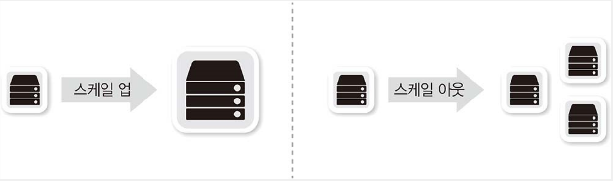
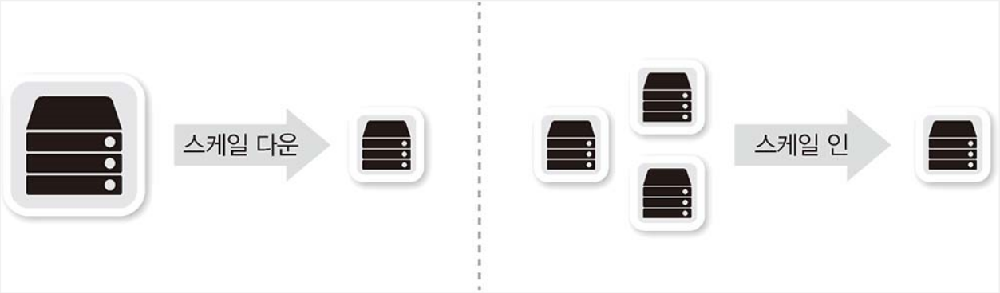

### 로드 밸런서

- 서버나 장비의 부하를 분산하기 위해 사용되는 장비이다.
- 어떤 기능이 있을까?
  - 트래픽을 분배해주는 기능이 있다.
  - 4계층 이상에서 동작하면서 IP 주소나 4계층 정보, 어플리케이션 정보를 확인, 수정하는 기능이 있다.
- 한대의 장비를 큰 부품을 사거나 내부 부품을 이중화하는 것은 비싸다.
  따라서, 작은 장비를 여러개를 그룹핑 하여 분산처리 하게끔 설계하는 확장 방법이다. (스케일 아웃)
- 작은 장비를 여러 대 운영해도 사용자는 어떤 서버에 들어오던 똑같은 서비스로 보여야한다.
  로드 밸런서가 대표 서비스IP를 갖고 그밑에 작은 장비를 붙여 로드밸런서에 요청(가상 IP)이 들어오면 이것을 각 장비의 실제 IP(리얼 IP)로 변경해 요청을 전달해줌.

- 4계층과 7계층의 로드밸런서
  - L4 로드 밸런싱
    - 일반적인 로드밸런싱 동작방식이다.
    - TCP, UDP 정보를 기반으로 로드 밸런싱을 수행.
    - 최근 로드 밸런서는 L4, L7을 모두 지원하지만, L7 지원 여부와 상관없이 L4에 대한 정보만 처리하면 L4 로드밸런싱이라고 한다.
  - L7 로드 밸런싱 (프록시)
    - ADC (Application Delivery Controller)라고 부르며, 프록시 역할을 한다.
    - HTTP, FTP, SMTP와 같은 어플리케이션 프로토콜 기반으로 로드밸런싱을 수행한다.
    - HTTP 헤더 정보나 URI와 같은 정보를 기반으로 부하를 분산한다.

#### L4 스위치

- 4계층에서 동작하면서 로드 밸런서 기능이 있는 스위치.
- 내부동작 방식은 4계층 로드 밸런서이지만 외형은 스위치처럼 여러개의 포트를 가지고 있다.
- 부하 분산, 성능 최적화, 리다이렉션 기능을 제공한다.
- L4 스위치 동작 조건
  - L4 스위치가 동작하려면 가상 서버, 가상 IP, 리얼 서버, 리얼 IP를 설정해야한다.
  - 설명
    - 가상 서버: 사용자가 바라보는 서비스
    - 가상 IP: 사용자가 접근해야 하는 서비스 IP 주소
    - 리얼 서버: 실제 서비스를 수행하는 서버
    - 리얼 IP: 실제 서버의 IP 주소

#### ADC (프록시)

- ADC는 어플리케이션 계층(L7)에서 동작하는 로드 밸런서이다.
- L4 스위치와는 달리 어플리케이션 프로토콜의 헤더와 내용을 이해하고 동작하므로 다양한 부하 분산, 정보 수정, 정보 필터링이 가능하다.
- 대부분의 ADC는 L4 스위치의 기능을 포함하고 로드 밸런싱 기능과 페일오버, 리다이렉션 기능도 함께 제공된다.
  캐싱, 압축, 콘텐츠 변환 및 재작성, 인코딩 변환 등이 가능하고 프로토콜 최적화 기능도 제공한다.

#### L4 스위치 와 ADC의 성능 최적화 기법

- L4스위치의 성능 향상 기법 (TCP Reuse, Connection Pooling)

  - L4 스위치는 TCP, UDP 정보를 기반으로 부하를 분산한다. 부하 분산 뿐만아니라 TCP 계층에서의 최적화와 보안 기능도 함께 제공한다.
    TCP레벨의 간단한 DoS공격을 방어하거나 서버 부하를 줄이기 위해 "TCP 세션 재사용"과 같이 보안 과 성능을 높여주는 기능도 제공.

- ADC 성능 최적화
  - 캐싱 기능
    - 서버에서 수행하는 작업 중 부하가 많이 걸리는 작업을 별도로 수행한다. 그 중 하나가 이미지나 정적 콘텐츠 캐싱 기능이다.
    - 처음 해당 이미지를 요청받으면 서버로부터 이미지를 전달받고 ADC에서 캐싱처리한 후 클라이언트로 전달.
      후에 클라이언트에서 똑같은 이미지를 요청받으면 ADC에서 서버에 요청하지않고 캐시된 이미지를 전달해준다.
  - 압축 기능
    - 클라이언트로부터 요청을 받아 웹서버로 콘텐츠를 받아오면 그것을 ADC가 받아 압축을 하여 클라이언트로 전달해준다.
      (웹서버에서 10M 콘텐츠를 받고 압축하여 5M의 콘텐츠를 클라이언트로 전달.)
  - SSL 오프로딩
    - 과거에는 개인정보가 전달되는 일부페이지만 SSL(HTTPS)을 사용했지만 오늘날은 웹사이트 전체를 SSL로 처리하는 추세이다.
      때문에 웹서버에 SSL 암복호화 부하가 늘고 있다. 그렇기 때문에 클라이언트에서 ADC 까지는 SSL로 처리하고 ADC에서 웹서버 까지는 HTTP로 통신하여 SSL 암복호화 부하를 줄인다.

##### 스케일 업, 스케일 아웃, 스케일 다운, 스케일 인

- 스케일 업 과 스케일 아웃
  

- 스케일 다운과 스케일 인
  
