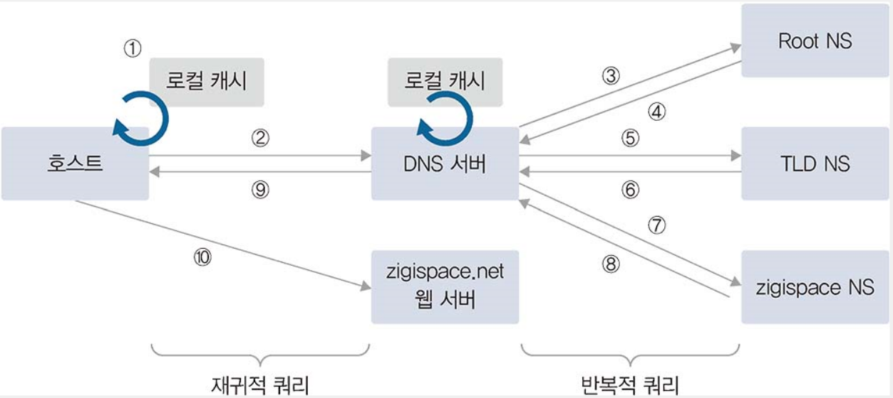

### DNS

- 도메인 주소를 IP 주소로 변환하는 역할을 한다.

#### DNS 구조와 명명 규칙

- 도메인은 계층 구조여서 역트리 구조로 최상위 Root부터 Top, Second, Third순으로 하위레벨로 원하는 주소를 단계적으로 찾아간다.
<pre>
  www.naver.com
  [Third-Level] . [Second-Level] . [Top-Level] (. [Root])
  -----www----- . ----naver----- . ----com---- (-생략 가능-)
  <------------------ Root 부터 거꾸로 찾아간다.
</pre>

- 각 레벨 도메인 설명
  - Root 도메인
    - 도메인을 구성하는 최상위 영역이다.
    - DNS서버에 해당 도메인의 정보가 없다면 루트 도메인을 관리하는 루트 DNS에 쿼리하게 된다.
  - TOP-Level 도메인 (TLD)
    - https://www.iana.org/domains/root/db 여기서 찾아보자

#### DNS 동작 방식

- 클라이언트 관점에서 DNS 질의 과정
  - 도메인을 IP 주소로 변환하려면 DNS서버에 도메인 쿼리하는 과정을 거쳐야한다.
    하지만 로컬에 hosts파일을 이용하면 DNS서버 없이도 도메인 리스트를 캐시에 저장할 수 있다.
  - 도메인을 쿼리하면 DNS서버에 쿼리하기전 로컬에 DNS 캐시정보를 먼저 확인한다.
    (캐시 정보에는 기존DNS 정보를 통해 확인한 동적 DNS 캐시와 hosts파일에 저장되어있는 정적DNS 캐시가 저장되어있음.)
  - 캐시정보에 도메인 정보가 없으면 DNS 서버로 쿼리를 수행하고 DNS서버로부터 응답 받으면 캐시에 먼저 저장하고 같은 쿼리로 요청하면 DNS서버에 들리지않고 캐시 정보를 이용한다.
- DNS 시스템관점에서 도메인에 대한 결괏값을 클라이언트로 보내주는 과정
  - 클라이언트에서 처음 질의를 받은 DNS가 중심이 되어 책임지고 루트 DNS부터 상위 DNS에 차근차근 쿼리를 보내 결괏값을 알아낸후 최종 결괏값만 클라이언트에 응답한다.
  - 클라이언트는 한 번의 쿼리를 보내지만 이 요청을 받은 DNS서버는 여러 단계로 쿼리를 상위 DNS서버에 보내 정보를 획득한다.

1. 사용자는 해당 도메인이 로컬캐시정보에 있는지 확인한다.
2. 로컬 캐시 정보에 없다면 DNS서버에 쿼리한다.
3. DNS서버의 로컬캐시와 static으로 설정되어있는지 확인하고 없으면 해당 도메인을 찾기 위해 Root NS에 TLD정보를 가진 도메인 주소를 쿼리한다.
4. TLD 네임 서버 정보를 DNS서버에 응답.
5. TLD 네임 서버에 도메인에 대한 정보를 다시 쿼리
6. TLD 네임 서버는 도메인 네임 서버에 대한 정보를 DNS서버로 응답
7. DNS는 네임 서버에 해당 도메인에 대한 정보를 쿼리한다.
8. 해당 도메인에 대한 정보를 DNS에 응답한다.
9. DNS서버는 해당 도메인에 대한 정보를 로컬 캐시에 저장하고 사용자에게 응답한다.
10. 사용자는 DNS서버로부터 받은 도메인에 대한 리얼IP정보를 이용해 사이트에 접속한다.

#### 마스터와 슬레이브

- DNS서버는 마스터 서버와 슬레이브 서버로 나눌 수 있다. (마스터 서버가 우선순위가 더 높지는 않다.)
- 마스터와 슬레이브는 도메인에 대한 존 파일을 직접 관리하냐 아니냐 에 따라 구분 되어진다. (직접 관리하면 마스터)
- 마스터는 존 파일을 직접 생성해 도메인 관련 정보를 관리하고, 슬레이브는 마스터의 존 파일을 정기적으로 복제한다. (영역 전송)
- 마스터는 자신의 도메인 정보를 다른 DNS서버가 복제해가지 못하도록 슬레이브를 지정해 복제를 제한할 수 있다.
  또, 마스터에서 별다른 설정을 하지 않으면 무제한 복제가 가능하므로 보안을 위해 복제가능한 슬레이브를 반드시 입력하는게 좋다.
- 다른 이중화와는 달리 DNS이중화에서는 마스터서버가 장애가 나면 슬레이브 서버는 주기적으로 존파일을 가져오지 못해 덩달아 장애가 난다.

#### Active-Stanby 와 Active-Active

- DNS에서 마스터와 슬레이브는 마스터가 장애가 나면 슬레이브도 장애가 난다.
  그래서 고안된것이 이 액티브-스탠바이 와 액티브-액티브 기술이다.
- 액티브-액티브는 두개의 마스터 서버를 동시에 서비스하고 한쪽이 장애가 나면 다른한쪽에서 서비스를 제공하는 방식이다.
- 액티브-스탠바이는 두개의 마스터 서버중 한쪽만 서비스를 하고 다른한쪽은 대기하고있다가 서비스하고있는 서버가 장애가 나면 대기하던 서버로 서비스를 하는 방식이다.

#### DNS 주요 레코드

| 레코드 종류            | 내용                                         |
| ---------------------- | -------------------------------------------- |
| A(IPv4 호스트)         | 도메인 주소를 IP주소(IPv4)로 매핑            |
| AAAA(IPv6 호스트)      | 도메인 주소를 IP 주소(IPv6)로 매핑           |
| CNAME(별칭)            | 도메인 주소에 대한 별칭                      |
| SOA(권한 시작)         | 본 영역 데이터에 대한 권한                   |
| NS(도메인의 네임 서버) | 본 영역에 대한 네임 서버                     |
| MX(메일 교환기)        | 도메인에 대한 메일 서버 정보(Mail eXchanger) |
| PTR(포인터)            | IP 주소를 도메인에 매핑(역방향)              |
| TXT(레코드)            | 도메인에 대한 일반 텍스트                    |

- A(IPv4) 레코드
  - 가장 기본 레코드로 도메인 주소를 IP주소로 변환하는 레코드이다.
- AAAA(IPv6) 레코드
  - A 레코드와 역할은 같지만 IPv6 주소체계에서 사용
- CNAME(Canonical Name) 레코드
  - 별칭 이름을 사용하게 해주는 레코드이다.
  - 레코드 값에 IP주소를 매핑하는 A레코드와는 달리 CNAME레코드는 도메인 주소를 매핑한다.
- SOA(Start Of Authority) 레코드
  - 도메인 영역에 대한 권한을 나타내는 레코드.
- NS(Name Server) 레코드
  - 도메인에 대한 권한이 있는 네임 서버 정보를 설정하는 레코드이다.
- MX(Mail eXchange) 레코드
  - 메일 서버를 구성할 때 사용되는 레코드이다. 해당 도메인을 메일 주소로 갖는 메일 서버를 MX레코드를 통해 선언한다.
- PTR(Pointer) 레코드
  - IP 주소에 대한 질의를 도메인 주소로 응답하기 위한 레코드이다.
- TXT(TeXT) 레코드
  - 도메인에 대한 설명과 같이 간단한 텍스트를 입력할 수 있는 레코드이다.
